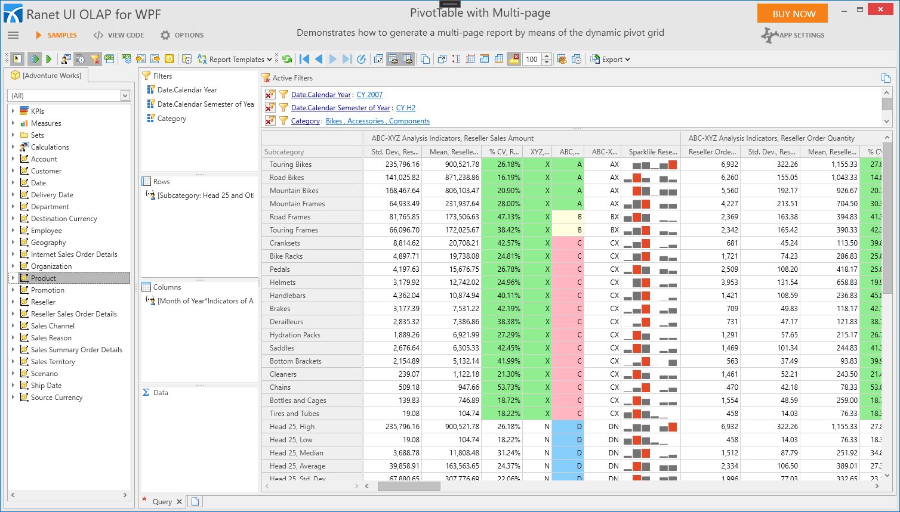

# Ranet OLAP Demos

Ranet OLAP Browser and other Visual Controls for XMLA datasources.

This repository contains technical Ranet OLAP demos for WPF and Windows Applications.

To run the demos on your machine, clone this repository and follow the instructions below.

## Prepare Demos for Development

## Contribute to the Ranet OLAP Demo samples

Source code corrections and new code samples are welcome.

## Quick Start

* [Connection String Storage](Docs/demo-configuration.md)
* [UICulture and Theme Manager](Docs/demo-culture-theme.md)

## Support & Feedback

If you have questions regarding Ranet OLAP Browser functionality, consult 
[tikets](https://galaktika-soft.com/tickets-list).

If you want to report a bug, request a feature, or ask a question, submit an issue to this repo. 

Alternatively, you can contact us at the Support Center if you own an active Ranet OLAP license.

## License

Familiarize yourself with the [Ranet OLAP License](https://galaktika-soft.com/ranet-olap/license). Free trial is available!

## See Also
* [Ranet OLAP](https://galaktika-soft.com/ranet-olap)
